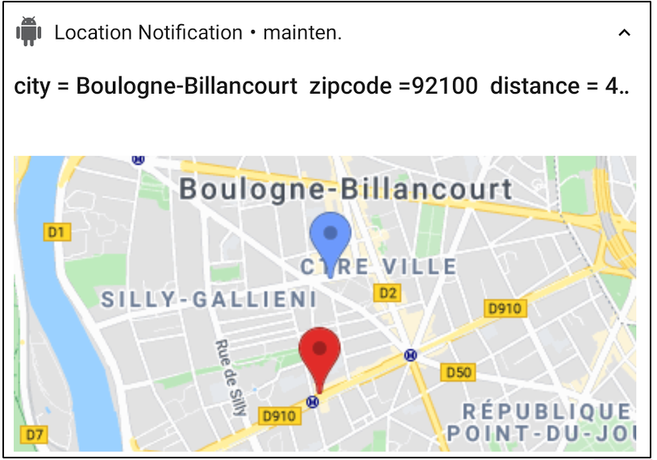
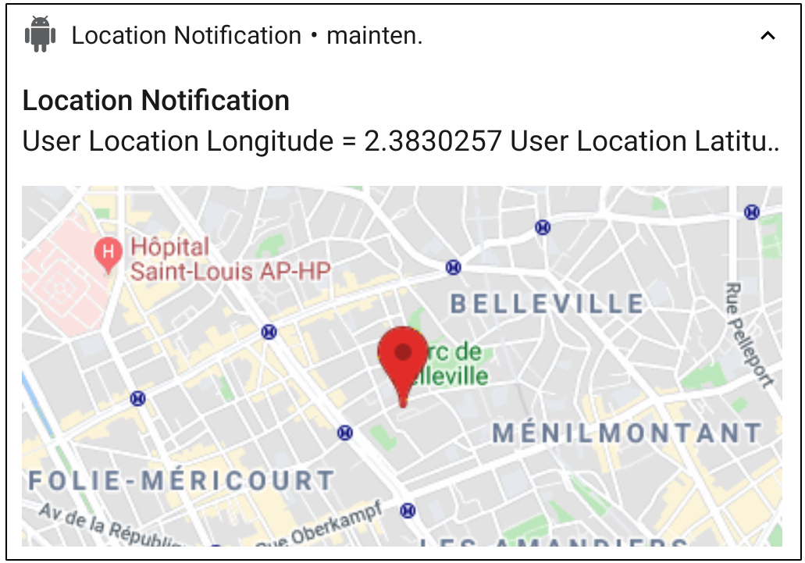
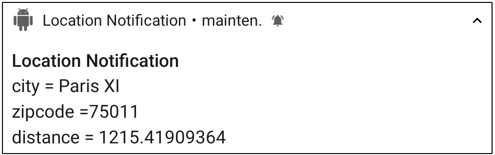

# Notification Service with Location and API calls

##  Overview

Get the location of user on notification to complete the payload with information from APIs. In this sample, we call a search API Woosmap to get the POIs nearrest of the location of the user and a call to Google Static Map to show where is the nearrest POI.

	

##  Pre-requisites

- Android SDK 29
- Android Build Tools
- Android Support Repository

##  Get Started

### Install
* This sample uses the Gradle build system. To build this project, use the "gradlew build" command or use "Import Project" in Android Studio.
* Get config file for your Android app
* Compile and install the mobile app onto your mobile device.
* Download Firebase config file :
	1.  Sign in to Firebase, then open your project.
	2.  Click , then select  **Project settings**.
	3.  In the  **Your apps**  card, select the package name of the app for which you need a config file.
	4.  Click   **google-services.json**, then add it to your app.

### Get Keys
* Get the token in the log debug or on the main screen of the app.
* If you want a map in the notification, get Google map Key for static map on [Google documentation](https://developers.google.com/maps/documentation/maps-static/get-api-key)

 	

* If you want find the nearest of your store from the user location, get Woosmap Key API on [Woosmap developer documentation](https://developers.woosmap.com/get-started)

	

* If you don't use the APIs with keys, you can only get the location of the user.

	

### Send Notification
* Install the app PushNotification from the github : https://github.com/onmyway133/PushNotifications for testing push notificaitons 
* Enter your server key : https://github.com/onmyway133/PushNotifications#android-server-key
* Enter a message in json format like this "{"location":"1","timestamp":"1589288354"}". The object "location" enable to have a location, and the "timestamp" object valid the delay between the time server and the time mobile to know if the location is reliable.
* If you want send notification from app android, we can use this app from the github : https://github.com/megamendhie/Notify. Change the code to enter the server key and the token of the notification app.

## Documentation

* [Enabling Location](./doc/EnablingLocation.md)
* [Set up a Firebase Cloud Messaging](./doc/SetupFirebaseCloudMessaging.md)
* [Handling messages](./doc/HandlingMessages.md)
* [Check Location permissions](./doc/CheckLocationpermissions.md)
* [Check Timestamp of the payload](./doc/CheckTimeStamp.md)
* [APIs request](./doc/APIsrequest.md)

