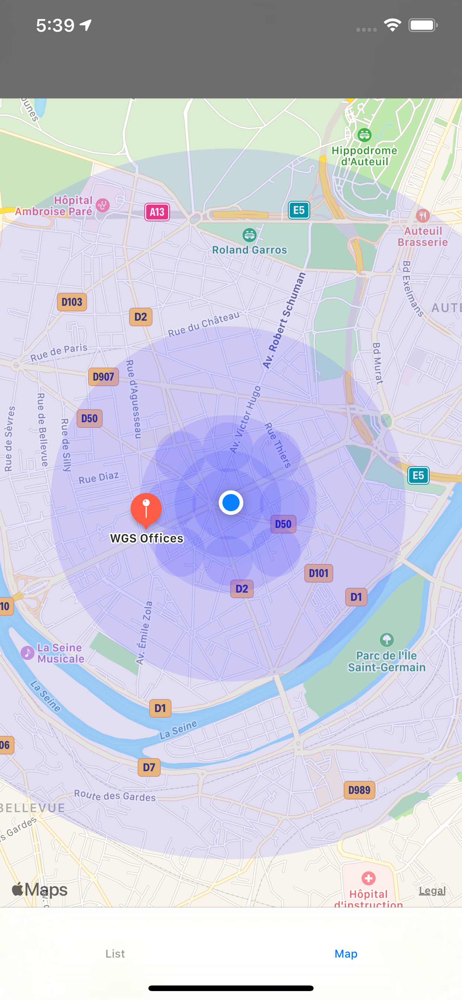
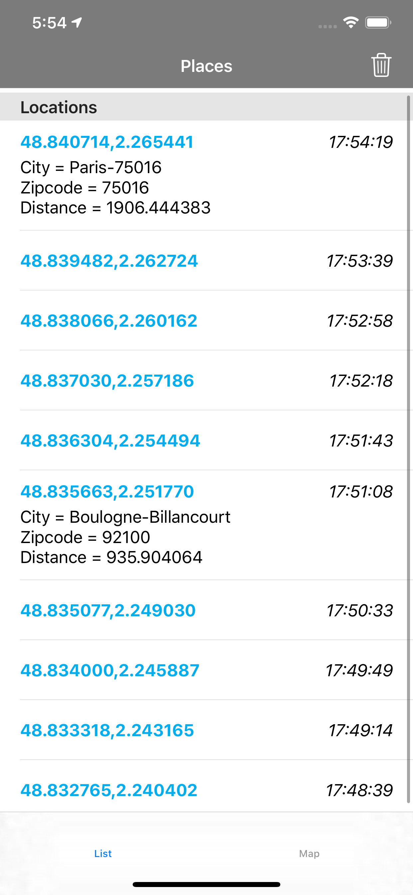

##  Overview

Get the location of user with most optimization battery and search the nearest POI. In this sample, we call a search API Woosmap to get the POIs nearrest of the location of the user with use less battery.

<p align="center">
  
</p>

##  Pre-requisites

- iOS 13 and above.
- Xcode 11 and above

## Installation
* Download the latest code version or add the repository as a git submodule to your git-tracked project.
* Open your Xcode project, then drag and drop source directory onto your project. Make sure to select Copy items when asked if you extracted the code archive outside of your project.
* Compile and install the mobile app onto your mobile device.

## Get Keys

* If you want find the nearest of your store from the user location, get Woosmap Key API on [Woosmap developer documentation](https://developers.woosmap.com/get-started).
<p align="center">
  
</p>
* If you don't use the APIs with keys, you can only get the location of the user.

## Usage 
# Init Services Location
The first step that should always be done each time your app is launched (in Foreground AND Background) is to set your Woosmap Private key Search API. This should be done as early as possible in your didFinishLaunchingWithOptions App Delegate. Depending on your integration, you should call startMonitoringInBackground too. This method must also be called everytime your app is Launched.
Set the `locationServiceDelegate` and `searchAPIDataDelegate` to retrieve data of location and POI when the data is ready. 
```swift
func application(_ application: UIApplication, didFinishLaunchingWithOptions launchOptions: [UIApplication.LaunchOptionsKey: Any]?) -> Bool {
        // Set private key Search API
        GeoSearch.shared.setWoosmapAPIKey(key: "YOUR_WOOSMAP_KEY")
        
        // Set your filter on position location and search
        GeoSearch.shared.setCurrentPositionFilter(distance: 10.0, time: 10)
        GeoSearch.shared.setSearchAPIFilter(distance: 10.0, time: 10)
        
        // Initialize the framework
        GeoSearch.shared.initServices()
        
        // Set delegate of protocol Location and POI
        GeoSearch.shared.getLocationService().locationServiceDelegate = DataLocation()
        GeoSearch.shared.getLocationService().searchAPIDataDelegate = DataPOI()
        
        // Check if the authorization Status of location Manager
        if (CLLocationManager.authorizationStatus() != .notDetermined) {
            GeoSearch.shared.startMonitoringInBackground()
        }
    return true
}
```

In order to be sure to avoid loosing data, you also need to call `startMonitoringInBackground` in the proper AppDelegate method : 
```swift
func applicationDidEnterBackground(_ application: UIApplication) {
    if (CLLocationManager.authorizationStatus() != .notDetermined) {
        GeoSearch.shared.startMonitoringInBackground()
    }
}
```

Too keep our SDK up to date with user's data we need to call `didBecomeActive` in the proper AppDelegate method too.
```swift
func applicationDidBecomeActive(_ application: UIApplication) {
    GeoSearch.shared.didBecomeActive()
    // Restart any tasks that were paused (or not yet started) while the application was inactive. If the application was previously in the background, optionally refresh the user interface.
}
```

In your class delegate, retrieve location data and POI date :
```swift
func tracingLocation(locations: [CLLocation], locationId: UUID) {
        let location = locations.last!
  
        let locationToSave = LocationModel(locationId: locationId, latitude: location.coordinate.latitude, longitude: location.coordinate.longitude, dateCaptured: Date(), descriptionToSave: "description")
        print("location to save = " + locationToSave.dateCaptured.stringFromDate())
        createLocation(location: locationToSave)
        self.lastLocation = location
    }
    
    func tracingLocationDidFailWithError(error: Error) {
        NSLog("\(error)")
    }

func searchAPIResponseData(searchAPIData: SearchAPIData, locationId: UUID) {
    for feature in (searchAPIData.features)! {        
    	let city = feature.properties!.address!.city!
        let zipCode = feature.properties!.address!.zipcode!
        let distance = feature.properties!.distance!
        let latitude = (feature.geometry?.coordinates![1])!
        let longitude = (feature.geometry?.coordinates![0])!
        let dateCaptured = Date()
        let POIToSave = POIModel(locationId: locationId,city: city,zipCode: zipCode,distance: distance,latitude: latitude, longitude: longitude,dateCaptured: dateCaptured)
        createPOI(POImodel: POIToSave)
    }
}
func serachAPIError(error: String) {
       // Catch Error
       NSLog("\(error)")
}
```

## GPX files
To testing geolocation in an iOS app, you can mock a route to simulate locations.  
For create a gpx files, the following tool converts a Google Maps link (also works with Google Maps Directions) to a .gpx file : https://mapstogpx.com/mobiledev.php
To emulate, foolow instruction here :  http://www.madebyuppercut.com/testing-geolocation-ios-app/

## Documentation

* [Enabling Location in different lifecycle](./doc/EnablingLocationLifecycle.md)
* [Get Location with optimizations](./doc/GetLocationOptimizations.md)
* [APIs request](./doc/APIsRequest.md)


