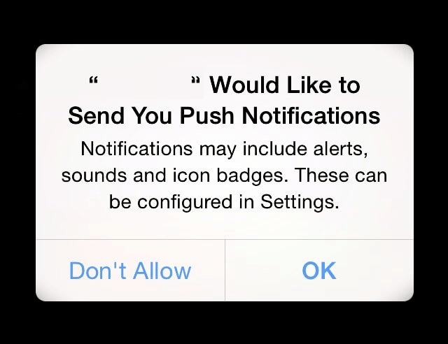

##  Enabling Location

### Setting Up Core Location
Here’s the code to get you started with Core Location in your iOS application:
```swift
var locationManager = CLLocationManager()  
locationManager.requestAlwaysAuthorization()
```
For  `allowsBackgroundLocationUpdates`, ensure that you’ve enabled the Background mode location from the Capabilities in your Xcode project.

iOS 13 has the following three location permissions (ignore Denied since it ignores the permission):

-   **Allow While In Use**  — has superpowers of Allowed
-   **Allow Once**  — temporary Allow While In Use
-   **Allowed**  — deferred until really needed



### Allow Once Permission

Allow Once is similar to Allow While Using, but only for one foreground session. That means that once you leave the application for a considerable time, the permission state changes to  `notDetermined`.

The next time the user starts the application, the developer can ask for the permissions again, depending on their use case. This gives users some finer control over the location data and also allows the developers to handler one-off location cases easily.

### Allow Always Hides in Allow While Using Permission

Allow While Using permission defers the Allow Always permission.

Always Allow permission isn’t there by default in the new permission dialog. It’s there in a provisional form so that it can be used when it’s actually required.

Let’s see how that works with the different kinds of location authorizations.


### Case 1 : requestAlwaysAuthorization

-   Allow While Using permission handles Allows Allow permission only if you've requested location authorization using  `requestAlwaysAuthorisation`.
-   With the above type of authorization, the user sees it as foreground permission, but  `CoreLocation`  informs the Delegate that it’s  `always`  permission. This way, it can monitor location events in the background, but the  `CLLocationManagerDelegate`  cannot receive those events.
-   `CoreLocation`  holds onto the events and asks the user at an appropriate time whether they would like to  `**Allow Always?**`. After that, the location events can be received in the background as well.
-   This way, Always Allow is deferred until a stage where it really requires the user’s consent for location updates in the background.
-   The above case makes Always Allow a provisional authorization.

### Case 2 :  `requestWhenInUseAuthorization`

-   In this case, Always Allowed never happens since the developers themselves hadn’t set it on the  `CLLocationManager`  instance.
-   Location is only accessed when the application is in the foreground (though it continues to access it for a very short interval once the user switches to the background).

